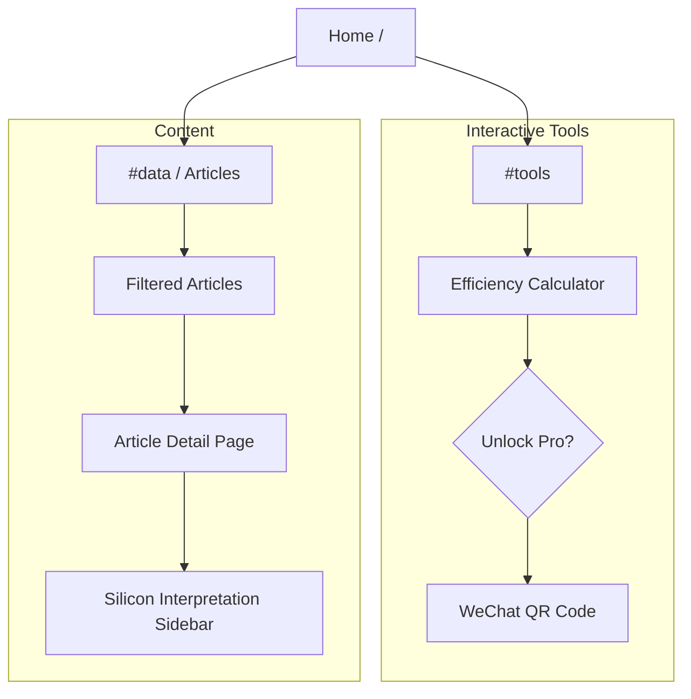

# 🎨 Website Design Specification

## 1. Design Philosophy
**Theme**: `Cyberpunk Engineering` (赛博工程风)
**Keywords**: Precision, Data-Driven, High-Contrast, Dark Mode Only.

The site should feel like a **Heads-Up Display (HUD)** of an advanced machine, not a generic blog.

## 2. Visual System

### Color Palette
| Token | Hex | Usage |
| :--- | :--- | :--- |
| `--c-bg-dark` | `#050505` | Main background (Near black, not pitch black) |
| `--c-bg-panel` | `#0a0a0a` | Cards / Modals background |
| `--c-accent-cyan` | `#00f0ff` | **Data**, Positive trends, Links, Active states |
| `--c-accent-amber` | `#ffae00` | **Warning**, Heat, High Energy, Interaction |
| `--c-accent-rose` | `#ff0055` | **Critical**, Errors, "Throttle" states |
| `--text-dim` | `#888888` | Labels, secondary text |

### Typography
*   **Headings**: `Inter` or System Sans-Serif (Clean, bold).
*   **Data / Code**: `SF Mono`, `Menlo`, or `JetBrains Mono` (Technical feel).

### UI Elements
*   **Borders**: 1px solid `rgba(255,255,255, 0.1)`.
*   **Glassmorphism**: Used sparingly for overlays (Efficiency Calculator Lock Screen).
*   **Grid Background**: Subtle 50px x 50px grid to emphasize "Engineering" vibe.

## 3. Site Map

## 4. User Flow (Conversion Strategy)

### Path A: The "Tool" User
1.  User lands on Home via search/link.
2.  Uses the **Efficiency Calculator** (Free Tier).
3.  Tries to use a "Pro" feature (e.g., "Add 2nd GPU" or "Unlock Battery Density").
4.  **Trigger**: Locked features show a blurred overlay.
5.  **Action**: "Follow 'Silicon Efficiency' on WeChat to unlock."

### Path B: The "Reader" User
1.  User lands on an Article page (SEO traffic).
2.  Reads deep-dive content (e.g., "Snapdragon 8 Gen 4 Analysis").
3.  Encounters a technical term (e.g., "TDP vs TGP").
4.  **Value Add**: "Silicon Interpretation" box explains it clearly.
5.  **Footer CTA**: "Get the full PDF report on WeChat."
