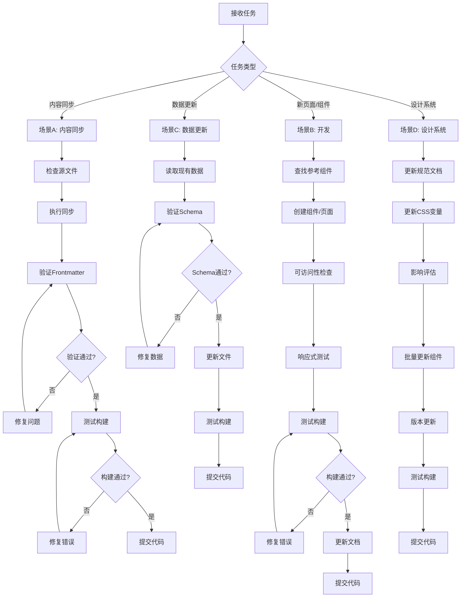

# AI Agent 自动化维护与生成指南

> **版本**: v1.0.1  
> **最后更新**: 2025-01-01  
> **目标**: 指引 AI (Cursor/Claude/GPT) 零误差执行网站生成、内容更新和维护任务  
> **兼容性**: 与 v1.0.0 兼容，新增快速参考和任务依赖关系图

## 快速参考（AI 执行任务时优先查看）

### 常用命令
- `npm run sync` - 内容同步（从微信到官网）
- `npm run build` - 构建测试（必须通过才能提交）
- `npm run dev` - 本地开发服务器
- `npm run validate:data` - 数据验证（如果已配置）

### 关键路径
- **项目根**: `05_Official_Website/`
- **内容目录**: `src/content/articles/`
- **组件目录**: `src/components/`
- **数据文件**: `src/data/chips.json`
- **样式文件**: `src/styles/global.css`

### 紧急修复指南
- **构建失败** → 检查 Markdown 语法、Frontmatter 格式
- **样式异常** → 检查 CSS 变量名拼写（区分大小写）
- **类型错误** → 检查 Props 接口定义、确认无 `any` 类型
- **图片404** → 确认图片在 `public/assets/` 目录，使用相对路径

### 核心规则（3条）
1. **所有颜色必须使用 CSS 变量**（禁止硬编码）
2. **所有组件必须有 Props 接口定义**（禁止 `any` 类型）
3. **所有数据必须符合 Schema**（参考 `data-schema.md`）

### 禁止行为（3条）
1. ❌ 禁止硬编码颜色值 → ✅ 使用 `--c-accent-cyan` CSS变量
2. ❌ 禁止使用 `any` 类型 → ✅ 定义具体类型接口
3. ❌ 禁止在未测试的情况下提交代码 → ✅ 运行 `npm run build` 验证

## 核心原则

### AI 执行任务前必读
在执行任何任务前，AI Agent 必须：
1. **加载核心上下文**: 阅读以下文档获取约束条件
   - `docs/design-system/README.md` (视觉约束)
   - `docs/technical/file-structure.md` (路径约束)
   - `docs/content/templates.md` (格式约束)
   - `docs/technical/code-standards.md` (代码规范)

2. **理解项目结构**: 确认项目根目录和关键路径
   - 项目根: `05_Official_Website/`
   - 内容目录: `src/content/articles/`
   - 组件目录: `src/components/`
   - 样式文件: `src/styles/global.css`

3. **遵守守卫规则**: 严禁违反 `AI 守卫规则` 章节中的禁止项

## 任务执行协议 (SOP)

### 任务依赖关系图



### 并发任务处理规则
- **优先级排序**: P0（紧急）> P1（重要）> P2（普通）
- **串行执行**: 同一时间只执行一个任务，避免文件冲突
- **冲突检测**: 如果任务涉及同一文件，等待前一个任务完成
- **状态持久化**: 长时间任务应在 `.agent/tasks/` 创建状态文件，支持中断恢复

### 场景 A: 内容自动更新 (Sync)

**任务描述**: 从微信公众号内容库同步文章到官网

**执行步骤**:
1. **检查源文件**: 确认 `03_Content_Factory/01_WeChat/Published/` 下有新文件
2. **执行同步**: 运行 `npm run sync`
3. **验证结果**: 
   - 检查 `src/content/articles/` 下新生成的 `.md` 文件
   - 验证 Frontmatter 是否完整（参考 `docs/content/templates.md`）
4. **修复问题**: 
   - 若 Frontmatter 缺失核心字段（title, date），根据模板补全
   - 若字数 < 800 且 `sync: true` 未设置，标记为需要人工审核
5. **测试构建**: 运行 `npm run build` 确保静态编译通过
6. **提交变更**: 如果构建成功，提交代码并推送到仓库

**异常处理**:
- **同步失败**: 检查 `scripts/sync-content.js` 日志，确认错误原因
- **构建失败**: 检查 Markdown 语法错误，修复后重试
- **冲突处理**: 如果文件已存在，检查 `website_slug` 是否冲突，必要时重命名

### 场景 B: 新页面/组件开发

**任务描述**: 创建新页面或组件

**执行步骤**:
1. **查找参考**: 在 `src/components/` 或 `src/pages/` 下查找相似组件/页面作为参考
2. **遵循规范**:
   - 组件命名: PascalCase (`EfficiencyCalculator.astro`)
   - 页面命名: kebab-case (`knowledge-base.astro`)
   - 样式: 必须使用 `src/styles/global.css` 定义的 CSS 变量
3. **可访问性检查**:
   - 所有图片必须有 `alt` 属性
   - 所有按钮必须有可访问的名称（文本或 `aria-label`）
   - 表单必须有 `label` 标签
   - 参考 `docs/design-system/accessibility.md`
4. **响应式测试**: 
   - 确保移动端 (< 768px) 布局正常
   - 确保触摸目标 ≥ 44px × 44px
5. **代码审查**: 
   - 运行 `npm run build` 确保无错误
   - 检查控制台无警告
6. **文档更新**: 如果创建了新组件，在 `docs/design-system/components.md` 中注册

**异常处理**:
- **样式冲突**: 检查是否有全局样式覆盖，使用更具体的选择器
- **构建错误**: 检查 TypeScript 类型错误，修复 Props 接口定义

### 场景 C: 数据更新 (产品数据库)

**任务描述**: 更新或新增产品数据

**执行步骤**:
1. **读取现有数据**: 打开 `src/data/chips.json` 了解数据结构
2. **验证 Schema**: 确保新数据符合以下结构（参考 `docs/content/templates.md`）:
   ```typescript
   interface ChipData {
     id: string;          // 格式: [品牌]-[代号]，如 "a18-pro"
     name: string;        // 显示名称
     process: string;    // 制程工艺
     type: "mobile" | "desktop" | "gpu";
     data_points: Array<{
       watts: number;     // 必须为正数
       score: number;     // 必须为正数
       scenario: string;  // 测试场景
     }>;
     last_updated: string; // 格式: YYYY-MM-DD
   }
   ```
3. **数据验证**:
   - `id` 必须唯一
   - `data_points` 数组不能为空
   - `last_updated` 必须为当前日期或未来日期
4. **更新文件**: 将新数据添加到 JSON 数组，保持 JSON 格式正确
5. **测试**: 运行 `npm run build` 确保数据解析正常

**异常处理**:
- **JSON 格式错误**: 使用 JSON 验证工具检查语法
- **ID 冲突**: 检查现有数据，使用新的唯一 ID

### 场景 D: 设计系统更新

**任务描述**: 更新颜色、字体或组件规范

**执行步骤**:
1. **更新规范文档**: 修改对应的设计系统文档
   - 颜色: `docs/design-system/colors.md`
   - 字体: `docs/design-system/typography.md`
   - 组件: `docs/design-system/components.md`
2. **更新 CSS 变量**: 如果涉及颜色/字体变更，更新 `src/styles/global.css`
3. **影响评估**: 检查现有组件是否受影响，必要时批量更新
4. **版本更新**: 更新文档版本号和变更日志
5. **测试**: 运行 `npm run build` 确保样式正常

**异常处理**:
- **破坏性变更**: 如果变更会影响现有页面，必须在变更日志中明确标注
- **样式丢失**: 检查是否有组件硬编码了旧值，需要批量替换

## AI 守卫规则 (Forbidden)

### 架构约束
- ❌ **禁止**: 创建新的根目录（除非文档明确要求）
- ❌ **禁止**: 在 `src/styles/global.css` 以外创建全局 CSS 文件
- ❌ **禁止**: 修改 `astro.config.mjs` 的核心配置（除非明确要求）
- ❌ **禁止**: 删除或重命名已有的核心组件（除非明确要求）

### 数据约束
- ❌ **禁止**: 修改已有 JSON 数据的 `id` 字段（防止断链）
- ❌ **禁止**: 删除已有文章的 Frontmatter 字段（除非明确要求）
- ❌ **禁止**: 修改已有文件的 URL slug（除非明确要求）

### 代码约束
- ❌ **禁止**: 使用硬编码颜色值（必须使用 CSS 变量）
- ❌ **禁止**: 使用 `any` 类型（必须定义具体类型）
- ❌ **禁止**: 创建未使用的组件或页面
- ❌ **禁止**: 在未运行 `npm run build` 测试的情况下提交代码

### 内容约束
- ❌ **禁止**: 生成字数 < 800 的文章（除非 `sync: true`）
- ❌ **禁止**: 生成包含"通知/招聘"关键词的内容（除非明确要求）
- ❌ **禁止**: 修改已有文章的发布日期（除非明确要求）

## 验证与测试

### 构建验证
每次修改后必须运行：
```bash
npm run build
```
**成功标准**: 
- 无错误输出
- 生成 `dist/` 目录
- 所有页面可访问

### 代码质量检查
- [ ] 无 TypeScript 类型错误
- [ ] 无 ESLint 警告（如果有配置）
- [ ] 所有图片有 `alt` 属性
- [ ] 所有链接有效（无 404）

### 性能检查
- [ ] Lighthouse 分数 ≥ 90
- [ ] 首屏加载 < 2s
- [ ] 无控制台错误

## 交付汇报模板

任务完成后，AI Agent 必须按以下格式汇报：

```markdown
## 任务完成汇报

### 任务类型
[内容更新 / 新页面开发 / 数据更新 / 设计系统更新]

### 修改文件
- `path/to/file1.astro` - [修改说明]
- `path/to/file2.md` - [修改说明]

### 新增内容
- [简述新增的功能或内容]

### 验证结果
- ✅ 构建测试: [通过/失败]
- ✅ 代码检查: [通过/失败]
- ✅ 性能测试: [通过/失败]

### 潜在风险
- [是否存在破坏性改动]
- [是否需要人工审核]

### 后续建议
- [是否需要更新文档]
- [是否需要通知团队成员]
```

## 常见错误与修复

### 错误 1: Frontmatter 解析失败
**症状**: `npm run build` 报错 "Invalid frontmatter"
**修复**: 
1. 检查 YAML 语法（缩进、引号）
2. 确保必填字段存在（title, date）
3. 参考 `docs/content/templates.md` 修复

### 错误 2: CSS 变量未定义
**症状**: 页面样式异常，控制台报错 "CSS variable not found"
**修复**:
1. 检查变量名拼写（区分大小写）
2. 确认变量在 `global.css` 中定义
3. 使用正确的变量名（如 `--c-accent-cyan`）

### 错误 3: 组件 Props 类型错误
**症状**: TypeScript 编译错误 "Property does not exist"
**修复**:
1. 检查组件 Props 接口定义
2. 确保传递的 Props 与接口匹配
3. 参考 `docs/technical/code-standards.md`

### 错误 4: 图片路径错误
**症状**: 图片无法加载，404 错误
**修复**:
1. 确认图片在 `public/assets/` 目录
2. 使用相对路径 `/assets/image.jpg`
3. 检查文件名大小写

## 参考文档索引

### 必读文档（任务前）
- [设计系统总览](./design-system/README.md)
- [文件结构规范](./technical/file-structure.md)
- [内容模板](./content/templates.md)
- [代码规范](./technical/code-standards.md)

### 参考文档（任务中）
- [颜色规范](./design-system/colors.md)
- [组件规范](./design-system/components.md)
- [可访问性规范](./design-system/accessibility.md)
- [SEO规范](./content/seo-guidelines.md)

### 故障排除（遇到问题时）
- [技术栈说明](./technical/tech-stack.md)
- [性能规范](./technical/performance.md)
- [内容更新流程](./content/update-process.md)

## 变更日志

### v1.0.1 (2025-01-01)
- 新增快速参考卡片（常用命令、关键路径、紧急修复）
- 添加任务依赖关系图（Mermaid）
- 明确并发任务处理规则
- 添加核心规则和禁止行为快速参考

### v1.0.0 (2025-01-01)
- 初始 AI Agent 指南
- 定义核心任务执行协议
- 建立守卫规则和验证标准

