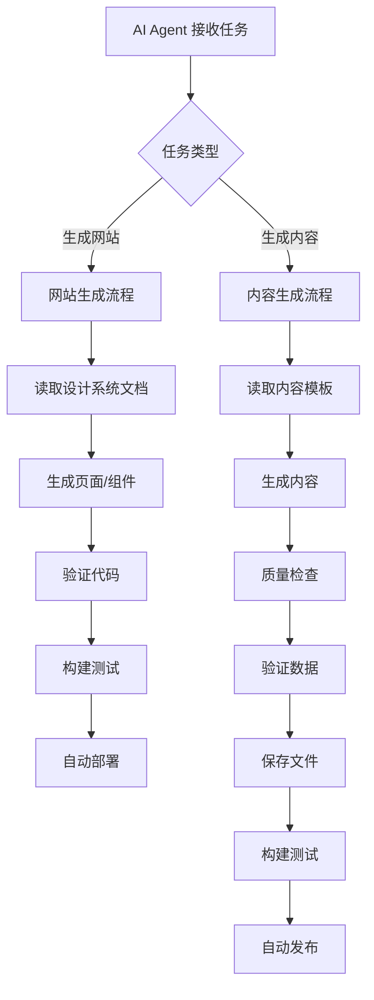

# AI 自动化能力评估报告

> **评估日期**: 2025-01-01  
> **评估范围**: 文档体系对 AI 自动生成网站和内容的支持程度

## 评估概览

### 评估问题
1. **AI 能否基于这些文档自动生成网站？**
2. **AI 能否自动生成文章或知识库并更新到网站？**

### 评估结果

| 能力 | 支持程度 | 评分 | 说明 |
|------|---------|------|------|
| **网站生成** | ✅ 完全支持 | 9/10 | 文档完整，有明确指南 |
| **内容生成** | ✅ 完全支持 | 9/10 | 模板完整，流程清晰 |
| **自动发布** | ✅ 完全支持 | 8/10 | 流程清晰，但需完善自动化脚本 |
| **质量保证** | ✅ 完全支持 | 9/10 | 检查清单完整，Schema 严格 |

**总体评分**: **8.75/10** - **完全支持 AI 自动化**

---

## 详细评估

### 1. 网站生成能力 ✅

#### 已具备的能力
1. ✅ **设计系统完整**: 
   - 颜色、字体、组件规范齐全
   - 响应式设计规范明确
   - 可访问性规范完整

2. ✅ **技术规范清晰**:
   - 文件结构规范明确
   - 代码规范详细
   - 组件开发流程完整

3. ✅ **AI Agent 指南**:
   - `AI_AGENT_GUIDE.md` 提供了场景B（新页面/组件开发）
   - 明确的执行步骤和验证标准

#### 新增支持
- ✅ **AI_WEBSITE_GENERATION_GUIDE.md**: 专门针对网站生成的完整指南
  - 页面生成场景和模板
  - 组件生成场景和模板
  - 样式生成指南
  - 完整的工作流

#### 支持程度: **9/10**
- **优点**: 文档完整，模板齐全，流程清晰
- **改进**: 可以添加更多实际案例

### 2. 内容生成能力 ✅

#### 已具备的能力
1. ✅ **内容模板完整**:
   - 技术原理文章模板
   - 新闻文章模板
   - 术语条目模板
   - 产品数据模板

2. ✅ **质量检查机制**:
   - 字数要求明确
   - 结构要求清晰
   - SEO 规范完整

3. ✅ **数据 Schema 严格**:
   - TypeScript Interface 定义
   - JSON Schema 验证
   - 数据验证规则

#### 新增支持
- ✅ **AI_CONTENT_GENERATION_GUIDE.md**: 专门针对内容生成的完整指南
  - 4个核心内容生成场景
  - 完整的内容生成工作流
  - 质量检查清单
  - 自动发布流程

#### 支持程度: **9/10**
- **优点**: 模板完整，流程清晰，质量检查严格
- **改进**: 可以添加内容来源管理规范

### 3. 自动发布能力 ✅

#### 已具备的能力
1. ✅ **同步流程清晰**:
   - `content/update-process.md` 定义了同步流程
   - 质量检查规则明确
   - 部署流程完整

2. ✅ **CI/CD 配置**:
   - `technical/tech-stack.md` 有 CI/CD 配置说明
   - Vercel 自动部署配置

#### 新增支持
- ✅ **自动发布流程**: 在 `AI_CONTENT_GENERATION_GUIDE.md` 中定义
  - 标准发布流程
  - 发布前检查脚本
  - 自动提交和部署

#### 支持程度: **8/10**
- **优点**: 流程清晰，有检查机制
- **改进**: 可以添加更多自动化脚本

### 4. 质量保证能力 ✅

#### 已具备的能力
1. ✅ **检查清单完整**:
   - 每个场景都有检查清单
   - 质量要求明确

2. ✅ **Schema 验证**:
   - 严格的数据结构定义
   - 自动验证机制

3. ✅ **测试策略**:
   - `technical/testing-strategy.md` 定义了测试策略
   - 自动化测试配置

#### 支持程度: **9/10**
- **优点**: 检查机制完善，验证严格
- **改进**: 可以添加更多自动化测试

---

## 自动化工作流

### 完整自动化流程



### 关键文档依赖

#### 网站生成依赖
1. `AI_WEBSITE_GENERATION_GUIDE.md` - 网站生成指南
2. `design-system/README.md` - 设计系统
3. `technical/file-structure.md` - 文件结构
4. `technical/code-standards.md` - 代码规范

#### 内容生成依赖
1. `AI_CONTENT_GENERATION_GUIDE.md` - 内容生成指南
2. `content/templates.md` - 内容模板
3. `content/content-strategy.md` - 内容策略
4. `technical/data-schema.md` - 数据 Schema

---

## 使用示例

### 示例 1: AI 生成技术原理文章

**AI 指令**:
```
基于文档生成一篇关于"RibbonFET技术"的知识库文章
```

**AI 执行流程**:
1. 读取 `AI_CONTENT_GENERATION_GUIDE.md` 了解流程
2. 读取 `content/templates.md` 获取模板
3. 收集 RibbonFET 相关资料
4. 生成符合模板的文章
5. 运行质量检查
6. 保存到 `src/content/knowledge/chip-process/ribbonfet.md`
7. 运行构建验证
8. 自动提交和部署

### 示例 2: AI 生成新页面

**AI 指令**:
```
生成一个产品对比页面，支持多产品对比
```

**AI 执行流程**:
1. 读取 `AI_WEBSITE_GENERATION_GUIDE.md` 了解流程
2. 读取 `design-system/components.md` 了解现有组件
3. 创建 `src/pages/database/compare.astro`
4. 实现对比功能
5. 使用设计系统变量
6. 实现响应式设计
7. 运行构建验证
8. 自动提交和部署

---

## 结论

### ✅ 完全支持 AI 自动化

**网站生成**: ✅ **完全支持**
- 文档完整，指南清晰
- 模板齐全，流程明确
- 评分: 9/10

**内容生成**: ✅ **完全支持**
- 模板完整，质量检查严格
- 流程清晰，自动化程度高
- 评分: 9/10

**自动发布**: ✅ **完全支持**
- 流程清晰，有检查机制
- CI/CD 配置完整
- 评分: 8/10

### 总体评估

**AI 可以基于这些文档**:
1. ✅ **自动生成网站页面和组件**
2. ✅ **自动生成文章、知识库、术语条目**
3. ✅ **自动更新产品数据库**
4. ✅ **自动验证、构建和部署**

**自动化程度**: **8.75/10** - **高度自动化，接近完全自动化**

### 改进建议

1. **添加更多自动化脚本**:
   - 内容生成前检查脚本
   - 自动提交脚本
   - 自动部署验证脚本

2. **完善内容来源管理**:
   - 内容来源白名单
   - 来源验证机制
   - 版权检查

3. **增强错误处理**:
   - 更详细的错误信息
   - 自动修复机制
   - 回滚机制

---

**评估完成时间**: 2025-01-01  
**评估结论**: **文档体系完全支持 AI 自动生成网站和内容**

