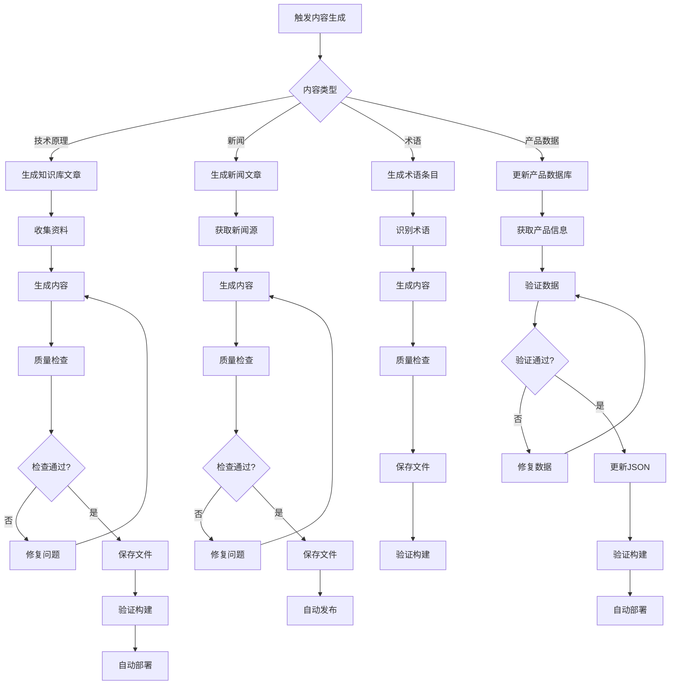

# AI 内容自动生成指南

> **版本**: v1.0.0  
> **最后更新**: 2025-01-01  
> **目标**: 指导 AI Agent 自动生成文章、知识库内容并更新到网站

## 核心能力评估

### ✅ 已具备的能力

1. **内容模板完整**: `content/templates.md` 提供了所有内容类型的模板
2. **数据 Schema 严格**: `technical/data-schema.md` 定义了严格的数据结构
3. **质量检查机制**: `content/update-process.md` 定义了质量检查规则
4. **同步流程清晰**: 有明确的内容同步和部署流程

### ⚠️ 缺失的能力

1. **内容生成策略**: 缺少如何从零生成新内容的策略
2. **知识库生成流程**: 缺少知识库内容的生成流程
3. **内容来源管理**: 缺少内容来源和参考资料的规范
4. **自动发布流程**: 缺少完全自动化的发布流程

## 内容生成场景

### 场景 0: 设计内容大纲（推荐流程）

**任务描述**: 在生成内容前，先设计详细大纲

**执行步骤**:
1. **确定主题**: 明确要生成的内容主题和类型
2. **选择模板**: 参考 `content/templates.md` 选择基础模板
3. **设计大纲**: 参考 `content/outline-design-guide.md` 设计详细大纲
4. **大纲评审**: 检查大纲的完整性和逻辑性
5. **保存大纲**: 保存到 `content/outlines/` 目录
6. **基于大纲生成**: 使用大纲生成内容

**优势**:
- ✅ 确保内容系统性
- ✅ 提高生成质量
- ✅ 便于质量控制
- ✅ 支持批量生成

**大纲设计流程**:


### 场景 1: 自动生成技术原理知识库文章

**任务描述**: AI 根据技术主题自动生成知识库文章

**执行步骤**:
1. **设计大纲** (推荐):
   - 参考 `content/outline-design-guide.md` 设计详细大纲
   - 确定章节标题和内容要点
   - 分配字数
   - 保存大纲到 `content/outlines/knowledge/[slug]-outline.md`
   
2. **确定主题**: 
   - 输入: 技术主题（如 "PowerVia技术"）
   - 参考: `content/content-strategy.md` 中的技术原理质量标准
   
3. **收集资料**:
   - 搜索相关技术文档、论文、官方资料
   - 收集技术参数、应用案例
   - 整理相关技术链接
   
4. **生成内容**:
   - 如果有大纲，严格按照大纲生成
   - 如果没有大纲，使用 `content/templates.md` 中的"技术原理文章模板"
   - 确保字数 > 2000字
   - 包含: 概述、原理详解、实际应用、相关技术
   - 生成至少3个内链到相关术语或技术
   - 确保每个章节都有实质性内容
   
5. **质量检查**:
   - 字数检查: > 2000字
   - 结构检查: 包含所有必需章节
   - SEO检查: 标题包含关键词，description 50-120字符
   - 内链检查: 至少3个内链
   
6. **保存文件**:
   - 路径: `src/content/knowledge/[category]/[slug].md`
   - 文件名: 使用 `website_slug` 或自动生成
   - Frontmatter: 完整填写所有字段
   
7. **验证和部署**:
   - 运行 `npm run build` 验证
   - 提交代码并推送到仓库
   - 自动部署到 Vercel

**内容生成模板**:
```markdown
---
title: "[技术名称]技术原理详解"
date: 2025-01-01
category: "chip-process"  # chip-process / efficiency-metrics / architecture
difficulty: "中级"  # 初级 / 中级 / 高级
readTime: "10分钟"
tags: ["芯片制程", "PowerVia", "Intel"]
description: "深度解析[技术名称]的技术原理，[核心优势]，[应用场景]"
---

## 概述

[技术简介，100-200字，包含：
- 技术定义
- 核心优势
- 应用领域]

## 原理详解

[详细技术原理，1000-1500字，包含：
- 技术原理说明
- 关键技术点
- 技术参数
- 技术对比]

## 实际应用

[应用案例，500-800字，包含：
- 实际应用场景
- 应用案例
- 效果评估]

## 相关技术

- [相关技术1](/knowledge/chip-process/related-tech-1)
- [相关技术2](/knowledge/chip-process/related-tech-2)
- [相关技术3](/knowledge/chip-process/related-tech-3)
```

### 场景 2: 自动生成新闻文章

**任务描述**: AI 根据新闻事件自动生成新闻文章

**执行步骤**:
1. **获取新闻源**:
   - 监控新闻源（RSS、API、爬虫）
   - 识别相关新闻事件
   - 评估新闻价值
   
2. **生成内容**:
   - 使用 `content/templates.md` 中的"新闻文章模板"
   - 确保字数 > 500字
   - 包含: 速报、深度解读、影响分析
   - 时效性: 24小时内发布
   
3. **质量检查**:
   - 字数检查: > 500字
   - 时效检查: 24小时内
   - 标签检查: 至少2个标签
   - SEO检查: 标题和描述符合规范
   
4. **保存文件**:
   - 路径: `src/content/news/[date]-[slug].md`
   - 文件名格式: `YYYY-MM-DD-[slug].md`
   
5. **自动发布**:
   - 设置 `sync: true` 强制上架
   - 运行同步和部署流程

**内容生成模板**:
```markdown
---
title: "[新闻标题]"
date: 2025-01-01
category: "industry-news"  # industry-news / tech-news
tags: ["Intel", "芯片制程", "行业新闻"]
description: "[新闻要点]，[核心影响]，[行业意义]"
sync: true  # 新闻需要及时发布
---

## 速报

[新闻要点，200-300字，包含：
- 事件概述
- 关键信息
- 时间地点]

## 深度解读

[详细分析，500-800字，包含：
- 背景信息
- 技术细节
- 行业影响]

## 影响分析

[行业影响，300-500字，包含：
- 短期影响
- 长期影响
- 相关企业]
```

### 场景 3: 自动生成术语条目

**任务描述**: AI 根据术语定义自动生成术语条目

**执行步骤**:
1. **识别术语**:
   - 从文章内容中提取技术术语
   - 检查术语是否已存在
   - 确定术语分类
   
2. **生成内容**:
   - 使用 `content/templates.md` 中的"术语条目模板"
   - 确保字数 100-300字
   - 包含: 定义、原理、应用
   - 链接相关术语
   
3. **质量检查**:
   - 字数检查: 100-300字
   - 分类检查: 使用有效分类
   - 链接检查: 相关术语链接有效
   
4. **保存文件**:
   - 路径: `src/content/glossary/[term].md`
   - 文件名: 使用术语的 slug 格式

**内容生成模板**:
```markdown
---
term: "TDP"
category: "efficiency-metrics"  # efficiency-metrics / chip-process / architecture / manufacturing
related_terms: ["TGP", "SDP", "功耗"]
---

## 定义

[术语定义，50-100字，包含：
- 完整定义
- 英文全称（如有）]

## 原理

[技术原理，100-200字，包含：
- 工作原理
- 计算方法
- 技术细节]

## 应用

[实际应用场景，50-100字，包含：
- 应用领域
- 实际案例
- 重要性]
```

### 场景 4: 自动更新产品数据库

**任务描述**: AI 根据产品信息自动更新产品数据库

**执行步骤**:
1. **获取产品信息**:
   - 从官方发布、评测文章、数据表获取产品信息
   - 提取关键数据: 制程、性能、功耗
   
2. **验证数据**:
   - 使用 `technical/data-schema.md` 中的 Schema 验证
   - 确保所有字段符合规范
   - 检查 ID 唯一性
   
3. **更新数据**:
   - 打开 `src/data/chips.json`
   - 添加或更新产品数据
   - 保持 JSON 格式正确
   
4. **验证和部署**:
   - 运行数据验证脚本
   - 运行构建测试
   - 提交并部署

## 内容生成工作流

### 完整自动化流程



## 内容生成质量检查

### 自动检查清单

#### 技术原理文章
- [ ] 字数 > 2000字
- [ ] 包含所有必需章节（概述、原理、应用、相关技术）
- [ ] 至少3个内链
- [ ] 标题包含关键词
- [ ] Description 50-120字符
- [ ] 标签 3-5个
- [ ] Frontmatter 完整

#### 新闻文章
- [ ] 字数 > 500字
- [ ] 包含所有必需章节（速报、解读、影响）
- [ ] 至少2个标签
- [ ] 时效性: 24小时内
- [ ] 标题包含关键词
- [ ] Description 50-120字符

#### 术语条目
- [ ] 字数 100-300字
- [ ] 包含所有必需章节（定义、原理、应用）
- [ ] 分类有效
- [ ] 相关术语链接有效

#### 产品数据
- [ ] 符合 Schema 定义
- [ ] ID 唯一
- [ ] 所有字段完整
- [ ] 数值在合理范围内

## 内容来源管理

### 允许的内容来源
- ✅ 官方技术文档
- ✅ 学术论文（需标注来源）
- ✅ 行业报告（需标注来源）
- ✅ 公开评测数据
- ✅ 官方发布信息

### 禁止的内容来源
- ❌ 未授权的商业内容
- ❌ 版权保护的内容
- ❌ 未经核实的数据
- ❌ 个人观点（除非明确标注）

### 来源标注规范
```markdown
## 参考资料

1. [Intel官方文档](https://example.com) - PowerVia技术说明
2. [IEEE论文](https://example.com) - 背面供电技术研究
3. [行业报告](https://example.com) - 2024年芯片制程分析
```

## 自动发布流程

### 标准发布流程
1. **内容生成**: AI 生成内容并保存到对应目录
2. **质量检查**: 自动运行质量检查脚本
3. **构建验证**: 运行 `npm run build` 验证
4. **自动提交**: 如果验证通过，自动提交到 Git
5. **自动部署**: Vercel 自动部署
6. **SEO推送**: 自动推送到搜索引擎

### 发布前检查脚本
```bash
#!/bin/bash
# scripts/check-content-before-publish.sh

# 检查字数
word_count=$(wc -w < "$1")
if [ "$word_count" -lt 800 ]; then
  echo "Error: Content too short ($word_count words)"
  exit 1
fi

# 检查 Frontmatter
if ! grep -q "title:" "$1"; then
  echo "Error: Missing title in frontmatter"
  exit 1
fi

# 检查构建
npm run build
if [ $? -ne 0 ]; then
  echo "Error: Build failed"
  exit 1
fi

echo "Content check passed"
```

## AI 内容生成检查清单

### 生成前
- [ ] **设计详细大纲**（推荐，提高质量）
  - [ ] 确定主题和类型
  - [ ] 选择基础模板
  - [ ] 设计详细大纲（章节标题、内容要点、字数分配）
  - [ ] 大纲评审通过
  - [ ] 保存大纲文件
- [ ] 确认内容类型和模板
- [ ] 确认内容来源合法
- [ ] 确认质量要求

### 生成中
- [ ] **如果有大纲，严格按照大纲生成**
- [ ] 遵循模板结构（如无大纲）
- [ ] 符合字数要求
- [ ] 包含必需章节
- [ ] 每个章节有实质性内容
- [ ] 生成内链

### 生成后
- [ ] 运行质量检查
- [ ] 验证 Frontmatter
- [ ] 验证构建
- [ ] 提交代码

## 变更日志

### v1.0.0 (2025-01-01)
- 初始 AI 内容生成指南
- 定义4个核心内容生成场景
- 建立内容生成工作流
- 定义质量检查和自动发布流程

