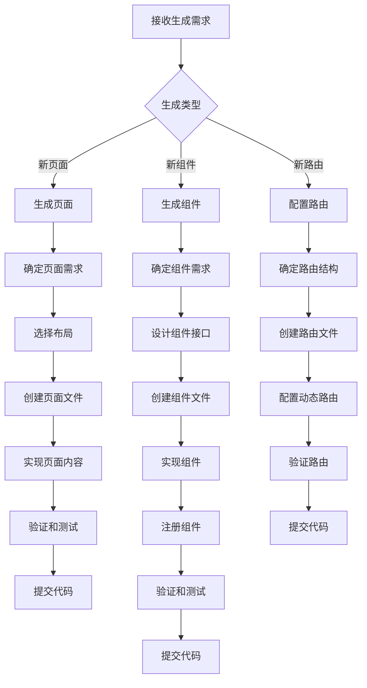

# AI 网站自动生成指南

> **版本**: v1.0.0  
> **最后更新**: 2025-01-01  
> **目标**: 指导 AI Agent 从零开始自动生成网站页面和组件

## 核心能力评估

### ✅ 已具备的能力

1. **设计系统完整**: `design-system/` 提供了完整的视觉规范
2. **文件结构清晰**: `technical/file-structure.md` 定义了目录结构
3. **代码规范明确**: `technical/code-standards.md` 定义了代码规范
4. **组件模板**: `design-system/components.md` 列出了现有组件

### ⚠️ 缺失的能力

1. **页面生成模板**: 缺少页面生成的完整模板
2. **组件生成流程**: 缺少从零创建组件的详细流程
3. **路由配置**: 缺少动态路由配置说明
4. **样式生成指南**: 缺少如何生成符合设计系统的样式

## 网站生成场景

### 场景 1: 生成新页面

**任务描述**: AI 根据需求自动生成新页面

**执行步骤**:
1. **确定页面需求**:
   - 输入: 页面类型、功能需求、内容结构
   - 参考: `architecture/site-map.md` 了解页面结构
   - 参考: `architecture/user-flows.md` 了解用户流程
   
2. **选择布局**:
   - 查看 `src/layouts/` 下的现有布局
   - 选择或创建合适的布局组件
   - 参考: `design-system/components.md`
   
3. **创建页面文件**:
   - 路径: `src/pages/[route].astro`
   - 命名: 使用 kebab-case
   - 参考现有页面结构
   
4. **实现页面内容**:
   - 使用设计系统的颜色和字体变量
   - 遵循响应式设计规范
   - 确保可访问性
   
5. **验证和测试**:
   - 运行 `npm run build` 验证
   - 检查响应式布局
   - 检查可访问性
   - 提交代码

**页面生成模板**:
```astro
---
// src/pages/knowledge/[category]/[slug].astro
import Layout from '../../../layouts/Layout.astro';
import { getCollection } from 'astro:content';

interface Props {
  category: string;
  slug: string;
}

const { category, slug } = Astro.params;
const entry = await getCollection('knowledge', ({ data }) => 
  data.category === category && data.slug === slug
);

if (!entry) {
  return Astro.redirect('/404');
}
---

<Layout title={entry.data.title}>
  <main class="knowledge-page">
    <article>
      <h1>{entry.data.title}</h1>
      <slot />
    </article>
  </main>
</Layout>

<style>
  .knowledge-page {
    max-width: 1200px;
    margin: 0 auto;
    padding: 2rem;
  }
  
  article {
    color: var(--c-text-primary);
  }
  
  h1 {
    font-size: var(--font-size-h1);
    color: var(--c-accent-cyan);
  }
</style>
```

### 场景 2: 生成新组件

**任务描述**: AI 根据需求自动生成新组件

**执行步骤**:
1. **确定组件需求**:
   - 输入: 组件功能、Props、样式需求
   - 参考: `design-system/components.md` 了解现有组件
   - 检查是否有类似组件可复用
   
2. **设计组件接口**:
   - 定义 Props 接口（TypeScript）
   - 确定必需和可选 Props
   - 参考: `technical/code-standards.md`
   
3. **创建组件文件**:
   - 路径: `src/components/ComponentName.astro`
   - 命名: PascalCase，与文件名一致
   
4. **实现组件**:
   - 使用设计系统的 CSS 变量
   - 遵循可访问性规范
   - 实现响应式设计
   
5. **注册组件**:
   - 在 `docs/design-system/components.md` 中注册
   - 更新版本号

**组件生成模板**:
```astro
---
// src/components/KnowledgeCard.astro
interface Props {
  title: string;
  description?: string;
  category: string;
  slug: string;
  readTime?: string;
}

const { title, description, category, slug, readTime = "5分钟" } = Astro.props;
---

<a href={`/knowledge/${category}/${slug}`} class="knowledge-card">
  <div class="card-header">
    <h3>{title}</h3>
    <span class="read-time">{readTime}</span>
  </div>
  {description && <p class="card-description">{description}</p>}
  <div class="card-footer">
    <span class="category">{category}</span>
  </div>
</a>

<style>
  .knowledge-card {
    display: block;
    background: var(--c-bg-card);
    border: 1px solid rgba(255, 255, 255, 0.1);
    border-radius: 4px;
    padding: 1.5rem;
    text-decoration: none;
    color: var(--c-text-primary);
    transition: transform 0.2s, border-color 0.2s;
  }
  
  .knowledge-card:hover {
    transform: translateY(-5px);
    border-color: var(--c-accent-cyan);
  }
  
  .card-header {
    display: flex;
    justify-content: space-between;
    align-items: start;
    margin-bottom: 1rem;
  }
  
  h3 {
    font-size: 1.5rem;
    font-weight: 600;
    color: var(--c-text-primary);
    margin: 0;
  }
  
  .read-time {
    font-size: 0.9rem;
    color: var(--c-text-secondary);
    font-family: var(--font-mono);
  }
  
  .card-description {
    color: var(--c-text-secondary);
    margin: 1rem 0;
    line-height: 1.6;
  }
  
  .card-footer {
    margin-top: 1rem;
    padding-top: 1rem;
    border-top: 1px solid rgba(255, 255, 255, 0.1);
  }
  
  .category {
    font-size: 0.9rem;
    color: var(--c-accent-cyan);
    font-family: var(--font-mono);
  }
  
  @media (max-width: 768px) {
    .knowledge-card {
      padding: 1rem;
    }
    
    h3 {
      font-size: 1.2rem;
    }
  }
</style>
```

### 场景 3: 生成知识库列表页

**任务描述**: AI 自动生成知识库分类列表页

**执行步骤**:
1. **确定分类**:
   - 参考: `architecture/content-structure.md` 了解分类体系
   - 确定分类 slug
   
2. **创建列表页**:
   - 路径: `src/pages/knowledge/[category].astro`
   - 实现分类筛选和列表展示
   
3. **实现列表组件**:
   - 使用卡片组件展示文章
   - 实现分页（如需要）
   - 实现搜索（如需要）

**列表页生成模板**:
```astro
---
// src/pages/knowledge/[category].astro
import Layout from '../../layouts/Layout.astro';
import { getCollection } from 'astro:content';
import KnowledgeCard from '../../components/KnowledgeCard.astro';

const { category } = Astro.params;
const allKnowledge = await getCollection('knowledge');
const categoryKnowledge = allKnowledge.filter(
  (entry) => entry.data.category === category
);

const categoryName = {
  'chip-process': '芯片制程',
  'efficiency-metrics': '能效指标',
  'architecture': '架构设计'
}[category] || category;
---

<Layout title={`${categoryName} - 知识库`}>
  <main class="knowledge-list-page">
    <header>
      <h1>{categoryName}</h1>
      <p class="description">探索{categoryName}相关的技术原理和深度分析</p>
    </header>
    
    <div class="knowledge-grid">
      {categoryKnowledge.map((entry) => (
        <KnowledgeCard
          title={entry.data.title}
          description={entry.data.description}
          category={entry.data.category}
          slug={entry.slug}
          readTime={entry.data.readTime}
        />
      ))}
    </div>
  </main>
</Layout>

<style>
  .knowledge-list-page {
    max-width: 1200px;
    margin: 0 auto;
    padding: 2rem;
  }
  
  header {
    margin-bottom: 3rem;
  }
  
  h1 {
    font-size: var(--font-size-h1);
    color: var(--c-accent-cyan);
    margin-bottom: 1rem;
  }
  
  .description {
    color: var(--c-text-secondary);
    font-size: 1.1rem;
  }
  
  .knowledge-grid {
    display: grid;
    grid-template-columns: repeat(auto-fill, minmax(300px, 1fr));
    gap: 2rem;
  }
  
  @media (max-width: 768px) {
    .knowledge-grid {
      grid-template-columns: 1fr;
    }
  }
</style>
```

## 样式生成指南

### 使用设计系统变量

**颜色**:
```css
/* ✅ 正确: 使用 CSS 变量 */
color: var(--c-text-primary);
background: var(--c-bg-card);
border-color: var(--c-accent-cyan);

/* ❌ 错误: 硬编码颜色 */
color: #e0e0e0;
background: #111111;
```

**字体**:
```css
/* ✅ 正确: 使用 CSS 变量 */
font-family: var(--font-sans);
font-size: var(--font-size-body);

/* ❌ 错误: 硬编码字体 */
font-family: 'Inter', sans-serif;
font-size: 16px;
```

### 响应式设计

```css
/* 移动端优先 */
.component {
  padding: 1rem;
}

/* 平板端 */
@media (min-width: 768px) {
  .component {
    padding: 1.5rem;
  }
}

/* 桌面端 */
@media (min-width: 1024px) {
  .component {
    padding: 2rem;
  }
}
```

### 可访问性

```astro
<!-- ✅ 正确: 包含可访问性属性 -->

<button aria-label="关闭弹窗">×</button>
<nav aria-label="主导航">...</nav>

<!-- ❌ 错误: 缺少可访问性属性 -->

<button>×</button>
```

## 网站生成工作流

### 完整自动化流程



## AI 网站生成检查清单

### 生成前
- [ ] 确认需求明确
- [ ] 检查是否有类似实现可复用
- [ ] 确认文件路径和命名规范

### 生成中
- [ ] 遵循设计系统规范
- [ ] 使用 CSS 变量（禁止硬编码）
- [ ] 实现响应式设计
- [ ] 确保可访问性

### 生成后
- [ ] 运行 `npm run build` 验证
- [ ] 检查响应式布局
- [ ] 检查可访问性
- [ ] 更新相关文档
- [ ] 提交代码

## 变更日志

### v1.0.0 (2025-01-01)
- 初始 AI 网站生成指南
- 定义3个核心生成场景
- 建立网站生成工作流
- 提供完整的代码模板

