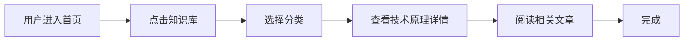
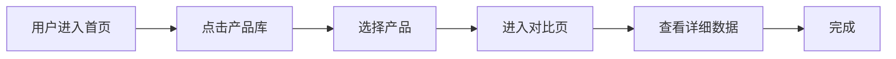
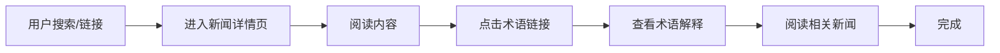

# 用户流程

> **版本**: v1.0.0  
> **最后更新**: 2025-01-01

## 核心用户流程

### 流程1: 查找技术原理

**步骤说明**:
1. 用户进入首页
2. 点击"知识库"导航
3. 选择技术分类（芯片制程/能效指标/架构设计）
4. 查看技术原理详情页
5. 通过相关推荐阅读更多内容

**错误状态处理**:
- **搜索无结果**: 显示"未找到相关内容"，提供"返回知识库首页"链接
- **分类为空**: 显示"该分类暂无内容"，推荐其他分类
- **加载失败**: 显示"加载失败，请刷新重试"按钮

**转化点**: 技术原理详情页的"关注获取完整报告"CTA

### 流程2: 对比产品

**步骤说明**:
1. 用户进入首页
2. 点击"产品库"导航
3. 选择要对比的产品
4. 进入产品对比页
5. 查看详细能效数据

**错误状态处理**:
- **产品数据缺失**: 显示"该产品数据暂未更新"，提供"查看其他产品"链接
- **对比产品不足**: 提示"至少选择2个产品进行对比"
- **数据加载失败**: 显示"数据加载失败，请稍后重试"，提供刷新按钮

**转化点**: 对比结果的"关注获取完整报告"CTA

### 流程3: 阅读新闻

**步骤说明**:
1. 用户通过搜索或链接进入新闻详情页
2. 阅读新闻内容
3. 点击术语自动链接
4. 查看术语解释
5. 通过相关推荐阅读更多新闻

**错误状态处理**:
- **术语链接失效**: 显示"该术语解释暂未添加"，提供"返回新闻"链接
- **相关推荐为空**: 显示"暂无相关新闻"，推荐最新新闻
- **图片加载失败**: 显示占位图和"图片加载失败"提示

**转化点**: 新闻详情页的"关注获取深度解读"CTA

## 用户旅程地图

### 新用户路径
1. **发现**: 搜索引擎 → 文章/知识库页面
2. **探索**: 浏览相关内容 → 点击相关推荐
3. **转化**: 遇到术语/需要数据 → 关注公众号

### 回访用户路径
1. **直接访问**: 收藏/书签 → 首页
2. **工具使用**: 使用能效计算器
3. **内容消费**: 阅读最新新闻/技术原理

## 转化策略

### 转化点设计
- **工具限制**: 免费版功能受限 → 关注解锁
- **内容深度**: 摘要预览 → 关注获取完整版
- **数据价值**: 基础数据 → 关注获取详细报告

### 转化流程
1. **触发**: 用户尝试使用受限功能/查看完整内容
2. **展示**: 显示微信二维码弹窗
3. **引导**: 明确说明关注后的价值
4. **完成**: 用户关注 → 解锁功能/内容

## 变更日志

### v1.0.0 (2025-01-01)
- 初始用户流程文档
- 基于现有用户路径设计

