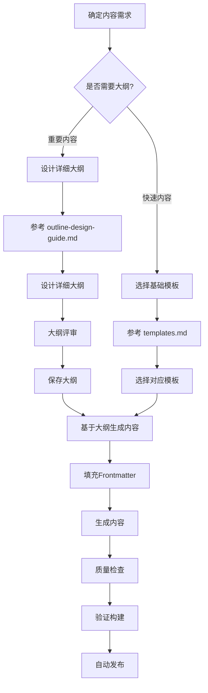

# 内容创建工作流

> **版本**: v1.0.0  
> **最后更新**: 2025-01-01  
> **目标**: 统一的内容创建流程，整合模板和大纲设计

## 文档职责划分

### 核心文档关系

```
content-creation-workflow.md (本文件)
    ├── templates.md (内容模板定义)
    └── outline-design-guide.md (大纲设计方法)
```

### 文档职责

| 文档 | 职责 | 内容 |
|------|------|------|
| **templates.md** | 模板定义 | Frontmatter模板、内容结构模板、数据Schema |
| **outline-design-guide.md** | 大纲设计 | 大纲设计流程、详细大纲模板、大纲管理 |
| **content-creation-workflow.md** | 工作流整合 | 统一的内容创建流程，整合模板和大纲 |

## 内容创建流程

### 完整工作流



### 快速参考

#### 场景1: 重要内容（推荐使用大纲）
1. 阅读 `outline-design-guide.md` 了解大纲设计方法
2. 参考 `templates.md` 选择基础模板
3. 设计详细大纲
4. 基于大纲生成内容

#### 场景2: 快速内容（直接使用模板）
1. 参考 `templates.md` 选择对应模板
2. 直接生成内容
3. 质量检查

## 文档使用指南

### 何时使用 templates.md
- ✅ 需要了解 Frontmatter 字段定义
- ✅ 需要查看内容结构模板
- ✅ 需要了解数据 Schema
- ✅ 需要快速生成内容

### 何时使用 outline-design-guide.md
- ✅ 需要设计详细大纲
- ✅ 需要提高内容质量
- ✅ 需要批量生成内容
- ✅ 需要确保内容系统性

### 何时使用本文件
- ✅ 需要了解完整的内容创建流程
- ✅ 需要了解文档之间的关系
- ✅ 需要选择合适的工作流

## 变更日志

### v1.0.0 (2025-01-01)
- 初始内容创建工作流文档
- 明确文档职责划分
- 整合模板和大纲设计流程

