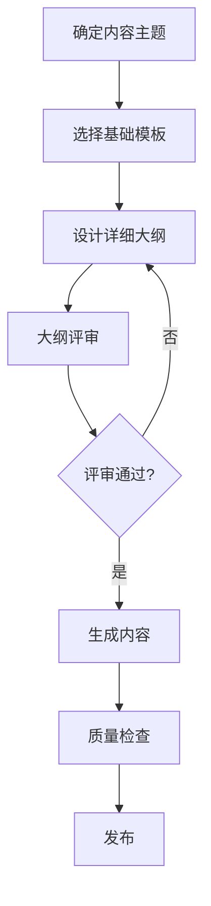

# 内容大纲设计指南

> **版本**: v1.0.0  
> **最后更新**: 2025-01-01  
> **目标**: 指导 AI Agent 为文章、知识库、术语条目设计详细大纲  
> **关联文档**: [内容模板](./templates.md) - 基础模板定义 | [内容创建工作流](./CONTENT_CREATION_WORKFLOW.md) - 完整流程

## 核心原则

### 为什么需要提前设计大纲？

1. **确保内容系统性**: 大纲是内容的"骨架"，确保逻辑清晰、结构完整
2. **提高生成质量**: 有明确大纲的内容质量更高，更符合预期
3. **便于质量控制**: 大纲可以作为质量检查的标准
4. **支持批量生成**: 可以批量设计大纲，然后批量生成内容

### 大纲设计层次

```
基础模板（通用结构）
    ↓
详细大纲（具体主题）
    ↓
内容生成（填充细节）
```

## 大纲设计流程

### 流程概览



### 详细步骤

1. **确定内容主题**
   - 明确主题范围
   - 确定目标读者
   - 确定内容类型

2. **选择基础模板**
   - 参考 [内容模板](./templates.md) 选择对应模板
   - 了解模板的基本结构要求
   - 基础模板提供通用结构，本指南提供详细扩展方法

3. **设计详细大纲**
   - 基于基础模板扩展
   - 填充具体章节标题
   - 确定每个章节的内容要点
   - 确定字数分配

4. **大纲评审**
   - 检查逻辑完整性
   - 检查章节平衡性
   - 检查是否符合质量标准

5. **生成内容**
   - 基于大纲生成内容
   - 确保每个章节都有实质性内容

## 技术原理知识库大纲设计

### 基础模板（参考 [templates.md](./templates.md)）

基础模板提供通用结构：
```markdown
## 概述
## 原理详解
## 实际应用
## 相关技术
```

**注意**: 基础模板是通用结构，本指南提供如何将其扩展为详细大纲。

### 详细大纲设计模板

#### 大纲结构

```markdown
# [技术名称]技术原理详解

## 大纲设计

### 1. 概述 (100-200字)
- [ ] 技术定义和背景
- [ ] 核心优势（3个要点）
- [ ] 应用领域
- [ ] 技术重要性

### 2. 原理详解 (1000-1500字)
- [ ] 2.1 基本原理
  - 核心概念
  - 工作原理
  - 关键技术点
- [ ] 2.2 技术细节
  - 实现方式
  - 技术参数
  - 性能指标
- [ ] 2.3 技术对比
  - 与传统技术对比
  - 与竞品技术对比
  - 优劣势分析

### 3. 实际应用 (500-800字)
- [ ] 3.1 应用场景
  - 主要应用领域
  - 典型应用案例
- [ ] 3.2 应用效果
  - 性能提升数据
  - 实际效果评估
- [ ] 3.3 应用挑战
  - 技术挑战
  - 工程挑战

### 4. 相关技术 (200-300字)
- [ ] 相关技术链接（至少3个）
- [ ] 技术关系说明
- [ ] 学习路径建议
```

#### 大纲设计示例

**主题**: PowerVia技术原理详解

```markdown
# PowerVia技术原理详解 - 详细大纲

## 1. 概述 (150字)
- 技术定义: Intel 18A制程的背面供电技术
- 核心优势: 
  - 降低信号延迟30%
  - 提升芯片密度
  - 改善散热性能
- 应用领域: 高性能计算芯片
- 技术重要性: 突破传统制程瓶颈

## 2. 原理详解 (1200字)
- 2.1 基本原理 (400字)
  - 核心概念: 将供电网络从正面移到背面
  - 工作原理: 通过硅通孔(TSV)连接
  - 关键技术点: 背面金属层、TSV工艺
- 2.2 技术细节 (500字)
  - 实现方式: 双面制造工艺
  - 技术参数: 通孔直径、金属层厚度
  - 性能指标: 电阻降低、电容优化
- 2.3 技术对比 (300字)
  - 与传统正面供电对比
  - 与RibbonFET结合的优势
  - 优劣势分析

## 3. 实际应用 (600字)
- 3.1 应用场景 (200字)
  - Intel 18A制程芯片
  - 高性能CPU和GPU
- 3.2 应用效果 (300字)
  - 性能提升: 频率提升15%
  - 功耗降低: 降低10%
- 3.3 应用挑战 (100字)
  - 制造复杂度增加
  - 成本上升

## 4. 相关技术 (250字)
- [RibbonFET技术](/knowledge/chip-process/ribbonfet)
- [TSV工艺](/knowledge/chip-process/tsv)
- [Intel 18A制程](/knowledge/chip-process/intel-18a)
```

### 大纲设计检查清单

- [ ] 概述部分包含技术定义、优势、应用领域
- [ ] 原理详解部分至少包含3个子章节
- [ ] 每个子章节有明确的内容要点
- [ ] 字数分配合理（总计2000+字）
- [ ] 包含至少3个相关技术链接
- [ ] 大纲逻辑清晰，层次分明

## 新闻文章大纲设计

### 基础模板（参考 [templates.md](./templates.md)）

基础模板提供通用结构：
```markdown
## 速报
## 深度解读
## 影响分析
```

### 详细大纲设计模板

```markdown
# [新闻标题] - 详细大纲

## 1. 速报 (200-300字)
- [ ] 事件概述
  - 时间、地点、人物
  - 核心事件
- [ ] 关键信息
  - 重要数据（3-5个）
  - 关键决策
- [ ] 一句话总结

## 2. 深度解读 (500-800字)
- [ ] 2.1 背景信息 (200字)
  - 事件背景
  - 相关历史
- [ ] 2.2 技术细节 (300字)
  - 技术要点
  - 技术参数
- [ ] 2.3 行业分析 (300字)
  - 行业影响
  - 竞争格局

## 3. 影响分析 (300-500字)
- [ ] 3.1 短期影响 (150字)
  - 市场反应
  - 股价影响
- [ ] 3.2 长期影响 (200字)
  - 技术趋势
  - 行业变革
- [ ] 3.3 相关企业 (150字)
  - 受益企业
  - 受影响企业
```

## 术语条目大纲设计

### 基础模板（参考 [templates.md](./templates.md)）

基础模板提供通用结构：
```markdown
## 定义
## 原理
## 应用
```

### 详细大纲设计模板

```markdown
# [术语名称] - 详细大纲

## 1. 定义 (50-100字)
- [ ] 完整定义
- [ ] 英文全称（如有）
- [ ] 所属分类

## 2. 原理 (100-200字)
- [ ] 2.1 工作原理 (80字)
  - 基本原理
  - 计算方法
- [ ] 2.2 技术细节 (120字)
  - 关键技术点
  - 技术参数

## 3. 应用 (50-100字)
- [ ] 应用领域
- [ ] 实际案例
- [ ] 重要性说明
```

## AI 大纲生成指南

### 自动生成大纲流程

1. **输入主题**
   ```
   主题: PowerVia技术
   类型: 技术原理知识库
   ```

2. **选择模板**
   - 读取 [内容模板](./templates.md) 获取基础模板
   - 读取本指南获取详细大纲模板
   - 基础模板提供结构，本指南提供扩展方法

3. **生成大纲**
   - 基于主题填充具体章节标题
   - 确定每个章节的内容要点
   - 分配字数

4. **大纲验证**
   - 检查是否符合质量标准
   - 检查逻辑完整性
   - 检查字数分配

### 大纲生成示例

**AI 指令**:
```
为"RibbonFET技术"设计详细大纲，类型：技术原理知识库
```

**AI 执行**:
1. 选择技术原理知识库模板
2. 生成详细大纲：
   ```markdown
   # RibbonFET技术原理详解 - 详细大纲
   
   ## 1. 概述 (150字)
   - 技术定义: Intel的下一代晶体管技术
   - 核心优势: 提升性能、降低功耗、缩小尺寸
   - 应用领域: 高性能计算芯片
   
   ## 2. 原理详解 (1200字)
   - 2.1 基本原理: 纳米带结构、栅极控制
   - 2.2 技术细节: 制造工艺、材料选择
   - 2.3 技术对比: 与FinFET对比
   
   ## 3. 实际应用 (600字)
   - 3.1 应用场景: Intel 20A/18A制程
   - 3.2 应用效果: 性能提升数据
   
   ## 4. 相关技术 (250字)
   - PowerVia技术
   - FinFET技术
   - Intel制程路线图
   ```
3. 验证大纲完整性
4. 保存大纲到 `content/outlines/ribbonfet-outline.md`

## 大纲存储和管理

### 大纲文件位置

```
content/
├── outlines/              # 大纲目录（新增）
│   ├── knowledge/         # 知识库大纲
│   │   ├── powervia-outline.md
│   │   └── ribbonfet-outline.md
│   ├── news/              # 新闻大纲
│   └── glossary/          # 术语大纲
```

### 大纲文件格式

```markdown
---
title: "[技术名称]技术原理详解"
type: "knowledge"
category: "chip-process"
status: "draft"  # draft / approved / generated
created: 2025-01-01
---

# 详细大纲

[大纲内容]
```

### 大纲状态管理

- **draft**: 草稿，待完善
- **approved**: 已批准，可以生成内容
- **generated**: 已生成内容，大纲归档

## 大纲设计最佳实践

### 设计原则

1. **逻辑清晰**: 章节之间逻辑连贯，层次分明
2. **内容平衡**: 各章节字数分配合理
3. **要点明确**: 每个章节有明确的内容要点
4. **可执行性**: 大纲足够详细，AI可以基于大纲生成内容

### 常见错误

❌ **错误**: 大纲过于简单
```markdown
## 概述
## 原理
## 应用
```

✅ **正确**: 大纲详细具体
```markdown
## 1. 概述 (150字)
- 技术定义: [具体定义]
- 核心优势: [3个具体优势]
- 应用领域: [具体领域]

## 2. 原理详解 (1200字)
- 2.1 基本原理 (400字)
  - 核心概念: [具体概念]
  - 工作原理: [具体原理]
```

### 质量检查

大纲设计完成后，检查：
- [ ] 章节标题具体（不使用"概述"、"原理"等通用词）
- [ ] 每个章节有明确的内容要点
- [ ] 字数分配合理
- [ ] 逻辑连贯
- [ ] 符合内容质量标准

## 变更日志

### v1.0.0 (2025-01-01)
- 初始大纲设计指南
- 定义大纲设计流程
- 提供详细大纲模板
- 建立大纲存储和管理规范

