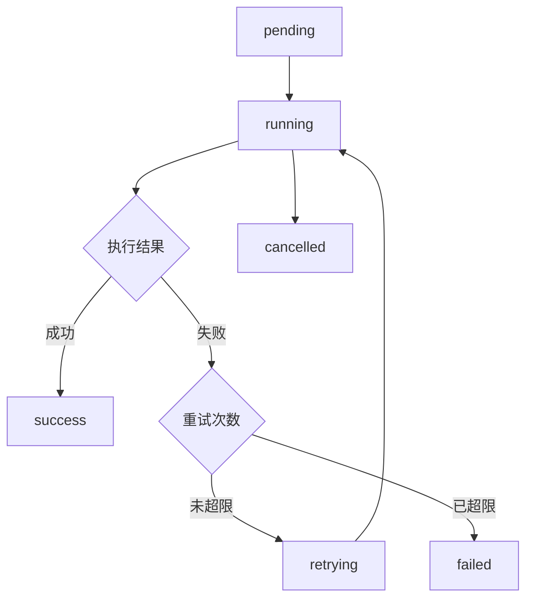

# 工作流编排配置

> **版本**: v1.0.0  
> **最后更新**: 2025-01-01  
> **目标**: 定义工作流触发机制、状态管理、重试策略和失败通知

## 工作流触发机制

### 触发类型

#### 1. 定时触发 (Scheduled)
**用途**: 定期执行的任务（内容同步、数据更新等）

**配置示例**:
```yaml
# .github/workflows/content-sync.yml
on:
  schedule:
    - cron: '0 */6 * * *'  # 每6小时执行一次
  workflow_dispatch:  # 允许手动触发
```

**常见定时任务**:
- 内容同步: 每6小时
- 数据更新: 每天凌晨2点
- 健康检查: 每小时
- 备份: 每天凌晨3点

#### 2. 事件驱动 (Event-Driven)
**用途**: 响应特定事件（代码推送、PR创建等）

**配置示例**:
```yaml
on:
  push:
    branches: [main]
    paths:
      - 'src/content/**'
      - 'src/data/**'
  pull_request:
    types: [opened, synchronize]
```

**常见事件**:
- `push`: 代码推送到仓库
- `pull_request`: PR创建或更新
- `workflow_dispatch`: 手动触发
- `repository_dispatch`: 外部API触发

#### 3. 手动触发 (Manual)
**用途**: 需要人工介入的任务

**配置示例**:
```yaml
on:
  workflow_dispatch:
    inputs:
      content_type:
        description: 'Content type'
        required: true
        type: choice
        options:
          - article
          - knowledge
          - news
```

## 工作流状态管理

### 状态定义

| 状态 | 说明 | 下一步动作 |
|------|------|-----------|
| `pending` | 等待执行 | 等待资源或依赖 |
| `running` | 正在执行 | 监控执行进度 |
| `success` | 执行成功 | 触发后续任务或通知 |
| `failed` | 执行失败 | 根据重试策略处理 |
| `retrying` | 重试中 | 等待重试完成 |
| `cancelled` | 已取消 | 清理资源 |

### 状态转换图



### 状态持久化

**存储位置**: `.agent/workflows/state/`

**状态文件格式**:
```json
{
  "workflow_id": "content-sync-20250101-120000",
  "status": "running",
  "started_at": "2025-01-01T12:00:00Z",
  "updated_at": "2025-01-01T12:05:00Z",
  "retry_count": 0,
  "max_retries": 3,
  "dependencies": ["data-validation"],
  "output": {
    "files_processed": 5,
    "files_succeeded": 4,
    "files_failed": 1
  }
}
```

## 重试策略

### 重试规则

#### 1. 指数退避 (Exponential Backoff)
**适用场景**: 网络请求、API调用失败

**配置**:
```javascript
const retryConfig = {
  maxRetries: 3,
  initialDelay: 1000,  // 1秒
  maxDelay: 30000,     // 30秒
  backoffMultiplier: 2
};

// 重试间隔: 1s, 2s, 4s, 8s, 16s, 30s (cap)
```

#### 2. 固定间隔 (Fixed Interval)
**适用场景**: 临时性错误、资源竞争

**配置**:
```javascript
const retryConfig = {
  maxRetries: 5,
  delay: 5000  // 固定5秒
};
```

#### 3. 立即重试 (Immediate)
**适用场景**: 数据验证失败、格式错误

**配置**:
```javascript
const retryConfig = {
  maxRetries: 2,
  delay: 0  // 立即重试
};
```

### 重试条件

**可重试的错误**:
- 网络超时
- API限流 (429)
- 临时服务不可用 (503)
- 数据格式错误（可自动修复）

**不可重试的错误**:
- 认证失败 (401)
- 权限不足 (403)
- 资源不存在 (404)
- 数据验证失败（需要人工修复）

### 重试实现示例

```javascript
// scripts/utils/retry.js
async function retryWithBackoff(fn, config = {}) {
  const {
    maxRetries = 3,
    initialDelay = 1000,
    maxDelay = 30000,
    backoffMultiplier = 2
  } = config;

  let delay = initialDelay;
  
  for (let attempt = 0; attempt <= maxRetries; attempt++) {
    try {
      return await fn();
    } catch (error) {
      if (attempt === maxRetries) {
        throw error;
      }
      
      // 判断是否可重试
      if (!isRetryableError(error)) {
        throw error;
      }
      
      // 等待后重试
      await sleep(delay);
      delay = Math.min(delay * backoffMultiplier, maxDelay);
    }
  }
}

function isRetryableError(error) {
  const retryableStatusCodes = [408, 429, 500, 502, 503, 504];
  return retryableStatusCodes.includes(error.status);
}
```

## 失败通知机制

### 通知渠道

#### 1. GitHub Actions 通知
**配置**:
```yaml
- name: Notify on failure
  if: failure()
  uses: actions/github-script@v6
  with:
    script: |
      github.rest.issues.create({
        owner: context.repo.owner,
        repo: context.repo.repo,
        title: `Workflow failed: ${{ github.workflow }}`,
        body: `Workflow run: ${{ github.server_url }}/${{ github.repository }}/actions/runs/${{ github.run_id }}`
      });
```

#### 2. 日志文件
**位置**: `.agent/workflows/logs/`

**格式**:
```
[2025-01-01 12:00:00] [ERROR] Workflow content-sync failed
[2025-01-01 12:00:00] [ERROR] Error: Network timeout
[2025-01-01 12:00:00] [ERROR] Retry attempt: 1/3
```

#### 3. 状态文件
**位置**: `.agent/workflows/state/failed/`

**格式**: JSON文件，包含失败详情和错误堆栈

### 通知规则

| 失败类型 | 通知方式 | 通知频率 |
|---------|---------|---------|
| 首次失败 | 日志记录 | 每次 |
| 重试失败 | 日志记录 | 每次 |
| 最终失败 | GitHub Issue + 日志 | 每次 |
| 连续失败 | 邮件通知（如配置） | 每天最多1次 |

## 任务依赖管理

### 依赖类型

#### 1. 硬依赖 (Hard Dependency)
**说明**: 必须等待依赖任务完成

**示例**:
```yaml
jobs:
  validate-data:
    runs-on: ubuntu-latest
    steps: [...]
  
  build:
    needs: validate-data  # 硬依赖
    runs-on: ubuntu-latest
    steps: [...]
```

#### 2. 软依赖 (Soft Dependency)
**说明**: 可以并行执行，但需要检查结果

**示例**:
```yaml
jobs:
  generate-content:
    runs-on: ubuntu-latest
    steps: [...]
  
  update-database:
    runs-on: ubuntu-latest
    steps: [...]
  
  deploy:
    needs: [generate-content, update-database]  # 软依赖
    if: always()  # 即使依赖失败也执行
    runs-on: ubuntu-latest
    steps: [...]
```

### 依赖判断逻辑

**决策树**:
```javascript
function shouldWaitForDependency(task, dependency) {
  // 硬依赖：必须等待
  if (task.dependencies.hard.includes(dependency.name)) {
    return true;
  }
  
  // 软依赖：检查状态
  if (task.dependencies.soft.includes(dependency.name)) {
    return dependency.status === 'success';
  }
  
  return false;
}
```

## 并发控制

### 并发规则

#### 1. 串行执行
**场景**: 数据更新、文件写入

**配置**:
```yaml
jobs:
  update-data:
    runs-on: ubuntu-latest
    concurrency:
      group: data-update
      cancel-in-progress: false  # 不允许取消进行中的任务
```

#### 2. 并行执行
**场景**: 内容生成、数据验证

**配置**:
```yaml
jobs:
  generate-articles:
    strategy:
      matrix:
        topic: [chip-process, efficiency-metrics, architecture]
    runs-on: ubuntu-latest
    steps: [...]
```

#### 3. 限流执行
**场景**: API调用、外部服务

**配置**:
```javascript
const rateLimiter = {
  maxConcurrent: 3,  // 最多3个并发
  queue: [],
  running: []
};
```

## 工作流版本管理

### 版本号规则

**格式**: `v{major}.{minor}.{patch}`

**示例**:
- `v1.0.0`: 初始版本
- `v1.1.0`: 新增功能
- `v1.1.1`: 修复bug

### 版本变更流程

1. **更新版本号**: 修改工作流文件中的版本号
2. **更新文档**: 在变更日志中记录变更
3. **测试验证**: 在测试环境验证新版本
4. **部署**: 合并到主分支
5. **回滚准备**: 保留旧版本配置

### 回滚策略

**自动回滚条件**:
- 连续失败3次
- 执行时间超过阈值
- 错误率超过50%

**手动回滚**:
```bash
# 恢复到上一个版本
git revert <commit-hash>
```

## 工作流执行日志

### 日志格式

```
[2025-01-01 12:00:00] [INFO] Workflow started: content-sync
[2025-01-01 12:00:05] [INFO] Step 1/5: Validate data
[2025-01-01 12:00:10] [INFO] Step 1/5: Completed (5s)
[2025-01-01 12:00:15] [INFO] Step 2/5: Generate content
[2025-01-01 12:00:20] [ERROR] Step 2/5: Failed - Network timeout
[2025-01-01 12:00:25] [INFO] Step 2/5: Retrying (attempt 1/3)
[2025-01-01 12:00:30] [INFO] Step 2/5: Completed (10s)
[2025-01-01 12:00:35] [INFO] Workflow completed: success (35s)
```

### 日志存储

**位置**: `.agent/workflows/logs/`

**文件命名**: `{workflow-name}-{timestamp}.log`

**保留策略**: 保留最近30天的日志

## 变更日志

### v1.0.0 (2025-01-01)
- 初始工作流编排配置
- 定义触发机制、状态管理、重试策略
- 建立失败通知和依赖管理机制


